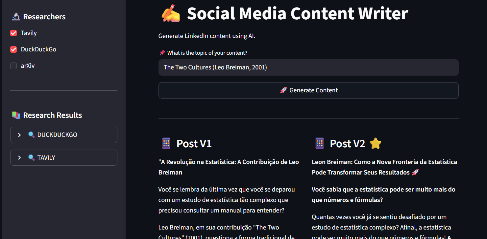
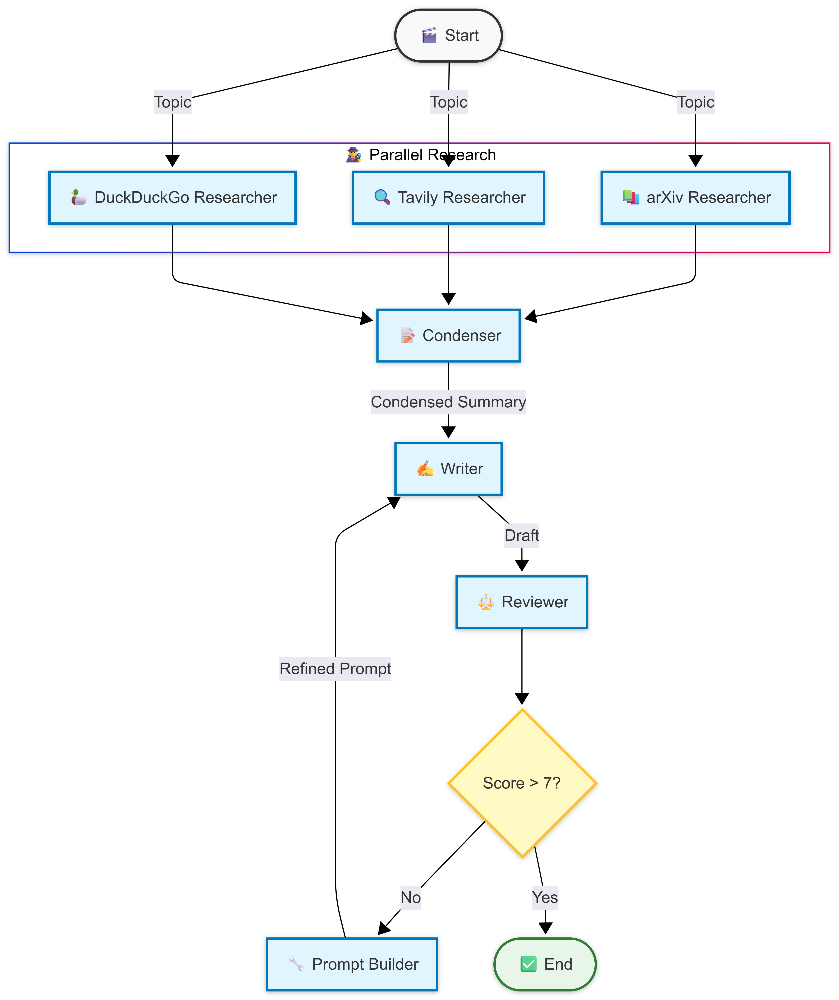

# 📝 AI LinkedIn Content Generator (Experimental)

> **⚠️ Status: Experimental / Proof of Concept**
> 
> This project is an experimental prototype to demonstrate content creation automation using AI Agents (see the Future Improvements section).

## 🎯 Objective

The main objective of this project is to **automate the creation of LinkedIn posts**, removing the human from the operational loop.

The idea is that the user provides only a **topic** and the system:
1. Researches multiple sources
2. Writes a draft
3. Evaluates quality
4. Automatically refines the content if the score is low

## 🖥️ Interface



🔗 **[Try the Live Demo](https://ai-content-creator.streamlit.app)**

## 💡 The Problem It Solves

Creating high-quality content takes time:
1. **Research**: Reading various articles and papers.
2. **Synthesis**: Connecting different dots.
3. **Writing**: Creating the text.
4. **Review**: Improving tone, formatting, and content.

Often, we stop at step 3 and post something "ok". This project attempts to solve this by automating the **Review and Refinement** cycle, ensuring the post is only delivered if it meets a quality standard.

## ✨ Current Features

- 🕵️ **Multi-Agent Research**: The system orchestrates multiple agents that utilize a suite of tools (ArXiv, Tavily, and DuckDuckGo) to collect data from the internet.
- 🔄 **Automatic Refinement (Self-Correction)**: If the post receives a low score, a "Prompt Builder" agent rewrites the instructions based on feedback and tries again.
- 📊 **Critical Evaluation**: A "Judge" agent evaluates the post with criteria for virality (hook, clarity, tone).
- 💾 **Persistence**: Saves history and metrics to MongoDB.
- 🎨 **Real-time Interface**: Streamlit displays the AI's thinking step-by-step.

## 🛠️ Technologies

- **[LangGraph](https://langchain-ai.github.io/langgraph/)**: For cyclic flow orchestration and state management.
- **[Hugging Face API](https://huggingface.co/inference-api)**: Access to LLMs (Llama-3, Qwen-2.5).
- **[Streamlit](https://streamlit.io/)**: User interface.
- **[MongoDB](https://www.mongodb.com/)**: NoSQL database.
- **[Pydantic](https://docs.pydantic.dev/)**: Data validation.
- **[DuckDuckGo](https://pypi.org/project/duckduckgo-search/) / [Tavily](https://tavily.com/) / [arXiv](https://arxiv.org/)**: Search APIs.

## ⚙️ How It Works

The system operates as a **State Graph**:


```

1. **Research**: 3 agents search for context.
2. **Synthesis**: An agent condenses everything into an actionable summary.
3. **Writing**: The Writer creates the first version (V1).
4. **Judgment**: The Judge gives a score and lists improvements.
5. **Loop**: If the score is low, the Prompt Builder creates specific instructions to correct errors and the Writer tries again (V2).

## 📁 Project Structure

```
assets/              # Images and visual resources
src/
├── graph/           # LangGraph Logic (Workflow)
├── nodes/           # Agents (Writer, Reviewer, Researchers...)
├── models/          # Data Schemas (Pydantic)
├── llm/             # API Client
└── database/        # MongoDB Connection
app/
└── main.py          # Streamlit Interface
```

## 🚀 Future Improvements Roadmap

This project is an MVP. To reach "State of the Art", the following improvements were identified:

### 1. Real Web Scraping vs Snippets
- **Problem**: Currently we only use "snippets" (short summaries) returned by DuckDuckGo/Tavily/arXiv. This loses depth.
- **Solution**: Implement a crawler that enters links, scrapes full content, and cleans HTML (using Firecrawl or similar).

### 2. Intelligent Deduplication with Embeddings
- **Problem**: Multiple sources may say the same thing, generating redundancy and high token consumption.
- **Solution**: Create vectors (embeddings) of each retrieved excerpt and use cosine similarity to discard repeated information before passing to the LLM.

### 3. More Powerful Models (SLMs/LLMs)
- **Problem**: Smaller models (like Llama-3-8B used here) struggle to follow complex formatting and tone instructions.
- **Solution**:
  - Use SOTA models (GPT-4o, Claude 3.5 Sonnet) for the "Judge" and "Prompt Builder".
  - Use SLMs (Small Language Models) specifically finetuned for LinkedIn writing (reducing cost and "bazookas for killing ants").

### 4. Checkpoints and Fault Tolerance
- **Problem**: If the API fails mid-flow, everything is lost.
- **Solution**: Implement state persistence (checkpointer) directly in **MongoDB**. This would save the graph state at each step, allowing one to resume from where it left off in case of a crash.

### 5. Hallucination Metrics (RAGAS)
- **Problem**: We don't know if the AI invented data.
- **Solution**: Implement the **RAGAS** (Retrieval Augmented Generation Assessment) framework in the testing pipeline to measure "Faithfulness" (fidelity to source) and "Answer Relevancy".

### 6. Post-Generation Rewriter Agent (Human-in-the-loop)
- **Problem**: Total automation may occasionally miss the specific tone or nuance desired.
- **Solution**: Allow manual or directed editing after final generation. Although the goal is to remove the human from the loop, having the option to "tweak" ensures the published content is 100% aligned when the AI misses requirements.

### 7. Academic Research Improvement
- **Problem**: Technical paper abstracts are dense.
- **Solution**: An intermediate agent that "translates" academic jargon into business language before passing to the writer.

### 8. Real-Time Cost Estimation and Calculation
- **Problem**: It is always important to keep in mind how much the AI application is spending to ensure the project's financial viability.
- **Solution**: Implement a telemetry system that counts tokens and API calls in real-time, calculating and displaying the estimated cost per execution in the Streamlit interface.

---
**Conclusion**: This project demonstrates the transition to **Self-Refining Agentic Architectures (Reflexion)**, where AI critiques and improves its own output. The potential is validated by cases like **[Poetiq](https://poetiq.ai/posts/arcagi_verified/)** (record holder in the ARC-AGI-2 benchmark without model training), showing that **better results come from the capacity to "think" and self-correct, not just from larger models.**